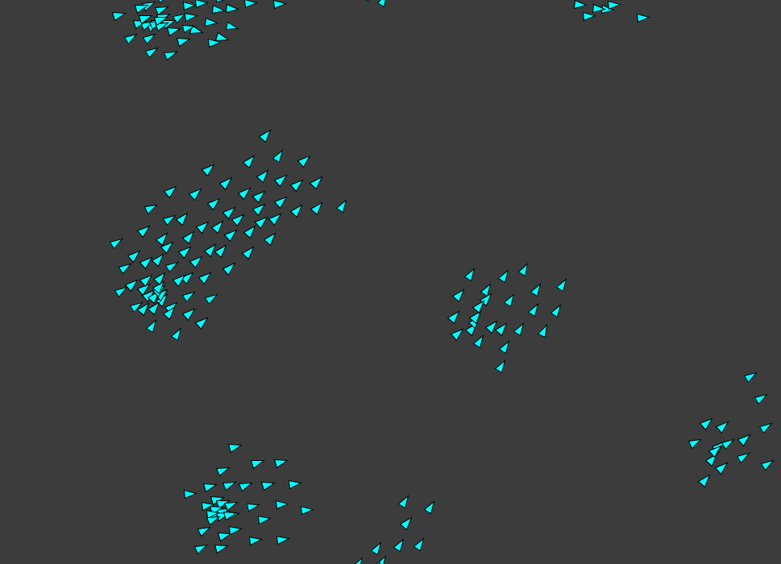

# Processing Sketchbook

A playground for writing processing programs in java

To change the sketch that is rendered, change the path in the Main method

To run this project, use `gradle run`

## Sketches

### Boids

A classic flocking simualtion based on the program by Craig Reynolds

